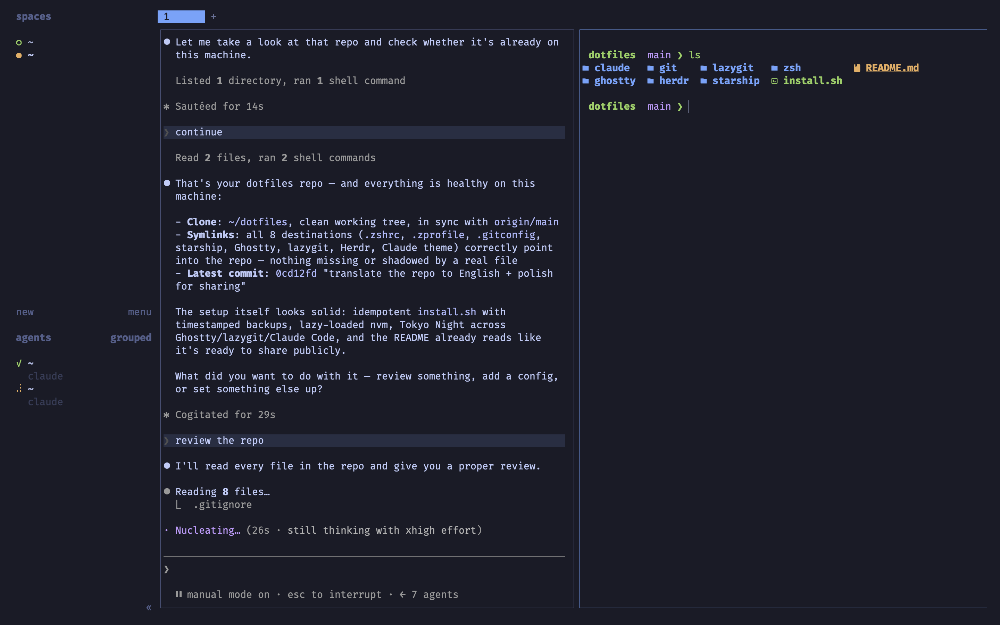

# dotfiles

A beautiful, comfortable and blazing-fast terminal workspace for macOS — **Tokyo Night everywhere**.



## What's inside

| Folder | File | Linked to |
|--------|------|-----------|
| `zsh/` | `.zshrc`, `.zprofile` | `~/.zshrc`, `~/.zprofile` |
| `git/` | `.gitconfig` | `~/.gitconfig` |
| `starship/` | `starship.toml` | `~/.config/starship.toml` |
| `ghostty/` | `config` | `~/Library/Application Support/com.mitchellh.ghostty/config` |
| `lazygit/` | `config.yml` | `~/Library/Application Support/lazygit/config.yml` |
| `herdr/` | `config.toml` | `~/.config/herdr/config.toml` |
| `claude/` | `themes/tokyo-night.json` | `~/.claude/themes/tokyo-night.json` |

## The stack

- **Terminal:** [Ghostty](https://ghostty.org) — Tokyo Night theme, FiraCode Nerd Font, frosted-glass background, global quick terminal on <kbd>⌘</kbd><kbd>`</kbd>
- **Workspace manager:** [Herdr](https://herdr.dev) — panes and workspaces built for AI coding agents, with lazygit popup, diff-review sidebar and Linear worktree shortcuts
- **Shell:** zsh + [Starship](https://starship.rs) one-line prompt + autosuggestions + syntax highlighting
- **Modern CLI:** eza · bat · fzf · zoxide · fd · ripgrep · git-delta · lazygit · neovim
- **Node toolchain:** fnm (auto-switches versions on `cd`) · ni (picks npm/pnpm/yarn from the lockfile) · direnv (per-project env vars)
- **Claude Code:** custom Tokyo Night TUI theme + finely calibrated scrolling (1 line per wheel event, no acceleration)

## Fast by design

- **fnm** — Rust-fast Node version manager: instant shell startup and automatic version switching when you `cd` into a project with `.nvmrc`
- **Cached compinit** — completions do a full re-scan at most once a day
- **One-line prompt** — no powerline, no gradients, nothing slowing you down
- **Git on autopilot** — `push.autoSetupRemote`, `pull.rebase` + `autoStash`, `rerere` (remembers conflict resolutions), pruned fetches, recency-sorted branches — plus fuzzy `gco`/`glog` helpers

## Install on a new machine

```bash
# 1. clone
git clone https://github.com/GustavoGJesus/dotfiles ~/dotfiles

# 2. install everything: Brewfile (tools, apps, font) + symlinks
cd ~/dotfiles && ./install.sh
```

Requires [Homebrew](https://brew.sh). The `Brewfile` declares the whole
toolchain; `install.sh` runs it automatically and then creates the symlinks.

> **Using this repo yourself?** Set your own identity in `git/.gitconfig`
> (name and email) before running `install.sh` — otherwise you'll be
> committing as me. 🙂

## How it works

`install.sh` creates **symlinks** from this repo to the place each tool expects.
The real files live here; the system just points at them. Editing anywhere =
editing the repo — then it's just a `git commit`.

Running `./install.sh` again is always safe (idempotent). Any real file found
at a destination is moved to `~/.dotfiles-backup/<timestamp>/` first.

## Updating after a change

```bash
cd ~/dotfiles
git add -A && git commit -m "tweak <file>" && git push
```
